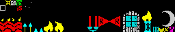

# Designing

To create your ZX Spectrum games you need to create/edit some images. Screens like title, loading, hud... and tileset that you will use to design your map and spriteset with your main character, enemies...

## Screens

You should create 4 screens png into assets/screens folder, loading.png, title.png, ending.png and hud.png

### Loading

This image (assets/screens/loading.png) will be user to loading screen. It will be show meanwhile your game is loading.

### Title

This image (assets/screens/title.png) will be show when your game be completly loaded and you should contain your menu options.

### Ending

This image (assets/screens/ending.png) will be show when you end the game.

### HUD

This image (assets/screens/hud.png) will be show at your game bottom zone to show how many life, keys and items you have in game. The size is exactly the same than other screens but you only need edit the bottom part

### Tile Set

You should create a 256x48 tiles png file (assets/tiles.png) into assets folder. ZX Game Maker works with 8x8 pixels tiles, then you can create 256 tiles into this png.

You should follow some rules to create this tileset:

* The first tile always should be the background.
* The second tile always should be your bullet.
* The first 64 tiles will be considerated as solid for the game maker.

#### Sprites

You should create a 256 x 32 sprites png file (sprites.png) into assets folder. Each sprite is 16x16 pixels.

The 8 first sprites (1 - 8) are reserved for game main character (0-2 for right movement, 3 for right jump, 4-6 for left movement, 7 for left jump).

The following 6 sprites (9 - 14) will be used for movement platforms, 2 tiles for each platform for animation.

The follow sprite can't be used (No effect if you design anything)

The follow sprite will be use for burst when you kill the enemies

The rest 16 tiles are reserved for enemies, 4 for each enemy, 2 frames for direction

