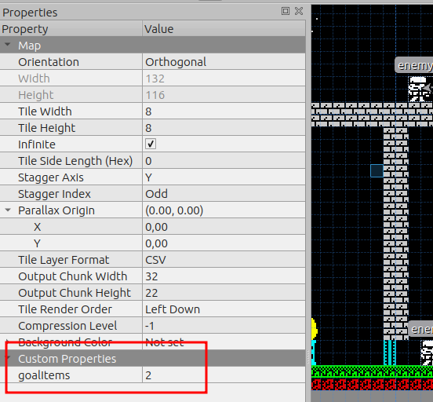

# Designing your screens and positioning your elements with Tiled

Tiled is a powerfull tool to design game screens. Using Tiled you can create the map of the game and put elements like enemies, keys, items and doors.

Our game will have screen with 32x22 tiles (You can change it).

## Create map

You should create a map with the following properties:

* Orientation: Orthogonal.
* Tile layer format: CSV.
* Tile render order: Right Down.
* Map size: Infinite.
* Tile size: 8x8px.

Then go to Map > Properties and set the map to **infinite** and Output Chunk Width to 32 and Output Chunk Height to 22

## Preferences

Or game will have 32x22 pixels for screen, then is recommended set in Preferences > Interface > Major grid to 32 tiles x 22 tiles to view each screen division. This option help you to tile and screen divisions

## Create tilesets

You should create 2 tilesets, tiles, importing tiles.png (8x8px) and sprites importing sprites.png (16x16px).

Is important to set **Object Aligment** to sprites tileset properties to **Top Left**.

## Create layers

I will use 2 layers a tile layer for tiles and object layer for enemies, keys, items, doors...

## Adding elements

### Enemy

You can add enemies into your map and set its movement (just horizontal for now). Set enemy in Type into object properties

#### Initial position

Select the object layer, click on insert tile button and put into the map adjusting in grid (press CTRL).

#### End position

For add en position:
* Click on insert point button.
* Put the point in the map (same x than enemy).
* Add custom object property and select the enemy related.

### Item

This is a colectable object that the main character should find arround the game to end it (Is configurable)

You need to set tile type as a **item** and then put it whatever you want in the map. To make it you should make click in gear button in tileset, select the tile and write **item** in type field.

### Door

This is a solid tile untreaspasable for your main character. You need to have at least 1 **key** to open it.

You need to set tile type as a **door** and then put it whatever you want in the map. To make it you should make click in gear button in tileset, select the tile and write **door** in type field.

### Key

You need to set tile type as a **key** and then put it whatever you want in the map.

You need to set tile type as a **key** and then put it whatever you want in the map. To make it you should make click in gear button in tileset, select the tile and write **key** in type field.

### Life item

This life item increase som amount of main character life (configurable).

You need to set tile type as a **life** and then put it whatever you want in the map. To make it you should make click in gear button in tileset, select the tile and write **life** in type field.

## General configuration

You can add general configuration of your game like number of items to collect as a game goal.

Custom properties:

* goalItems

